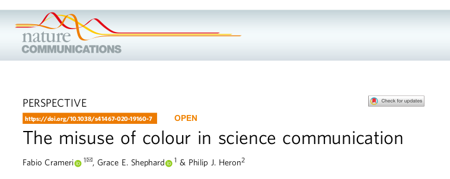
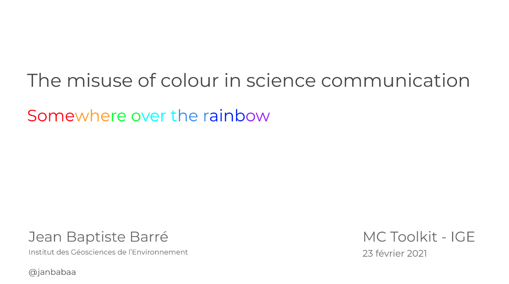

# The misuse of colour in science communication

Presented by [Jean-Baptiste Barré](http://pp.ige-grenoble.fr/pageperso/barrej/) on 23/02/2021

## Presentation

## Video

https://youtu.be/DgK-Uezkjao

## Links

### From Author
  - [Crameri’s website](http://www.fabiocrameri.ch/colourmaps.php)
  - The scientific material: https://zenodo.org/record/4491293#.YCaXIGhKiUk

### Colour-vision deficiency
  - https://blog.datawrapper.de/colorblindness-part1/
  - https://blog.datawrapper.de/colorblindness-part2/
  - https://blog.datawrapper.de/colorblindness-part3/

### Rainbow color scale
  - [The rainbow is dead ...long life to the rainbow](https://mycarta.wordpress.com/2012/05/29/the-rainbow-is-dead-long-live-the-rainbow-series-outline/)

### Climate science
  - [Constructive criticism of the graphics of climate science](https://betterfigures.org/2015/06/23/picking-a-colour-scale-for-scientific-graphics/)

### Talks - Video
  - [Perceptual Color Maps in matplotlib for Oceanography (K. Thyng - 2015)](https://www.youtube.com/watch?v=XjHzLUnHeM0&feature=emb_logo)
  - [A Better Default Colormap for Matplotlib (N.Smith and S.van der Walt - 2015)](https://www.youtube.com/watch?v=xAoljeRJ3lU)

### Others
  - Color Blindness Simulator: https://www.color-blindness.com/coblis-color-blindness-simulator/
  - Nice little tool for quick colour blind check: https://colororacle.org/
  - [Tool for choosing the most appropriate shades of your favorite colors](https://public.tableau.com/views/TableauColors/ColorPaletteswithRGBValues?%3Aembed=y&%3AshowVizHome=no&%3Adisplay_count=y&%3Adisplay_static_image=y&fbclid=IwAR0jUu4nSMRkIWvcRYzafNR0AGLwnyhI_uMK47tknHr4GlGZ8IlnHCYwSM4)
