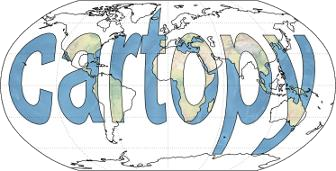

# Mapping with python: Cartopy

Here is the [pdf](2020_06_16_MARdi_cafe.pdf) and [notebook](notebook_cartopy.ipynb) of the talk given on Tuesday 16/06 2020 at Mardi Café by Fanny Brun. 

## Useful links

- Cartopy website: https://scitools.org.uk/cartopy/docs/latest/
- Stef Lhermite’s notebook: https://github.com/steflhermitte/EO-Notebooks/blob/master/RS_Notebook1_Mapping-in-python.ipynb

