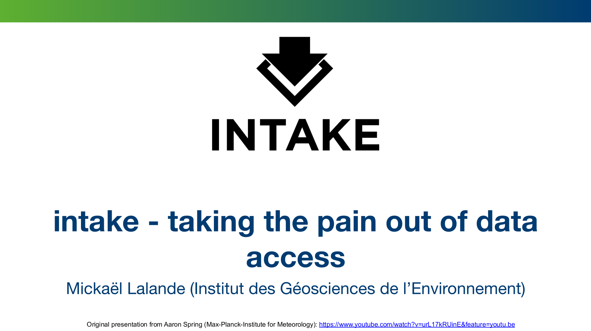

# [Intake](https://intake-esm.readthedocs.io/en/latest/user-guide/cmip6-tutorial.html) - taking the pain out of data access (CMIP6)

Presented by [Mickaël Lalande](https://mickaellalande.github.io/) on 26/01/2021

This presentation is to show experimental and promissing new packages. So far I still recommend French people to use CICLAD cluster where CMIP6 data are available. Nevertheless, this workflow might be also available in the near future in CICLAD too!

## Presentation

## Code

https://github.com/mickaellalande/intake_CMIP6

`main` branch works for personal computer and the branch `pangeo-notebook` is for [Pangeo-Cloud](https://pangeo.io/cloud.html) (slight differences in the way to launch Dask).

This code is experimental and not optimized.

## Links
  - [Load CMIP6 Data with Intake ESM](https://intake-esm.readthedocs.io/en/latest/user-guide/cmip6-tutorial.html)
  - [New climate model data now in Google Public Datasets](https://cloud.google.com/blog/products/data-analytics/new-climate-model-data-now-google-public-datasets)
  - [Pangeo](https://pangeo.io/) / [Dask](https://dask.org/)  ([presentation](https://github.com/mickaellalande/MC-Toolkit/tree/master/Managing-big-data-in-geasciences-with-PANGEO) from Aurélie)
  - [xarray](http://xarray.pydata.org/) ([presentation](https://github.com/mickaellalande/MC-Toolkit/tree/master/conda_environment_xarray_xesmf_proplot/xarray) from Mickaël)
  - [CLIMAF](https://climaf.readthedocs.io/en/master/) ([presentation](https://github.com/mickaellalande/MC-Toolkit/tree/master/CLIMAF_martin) from Martin)
